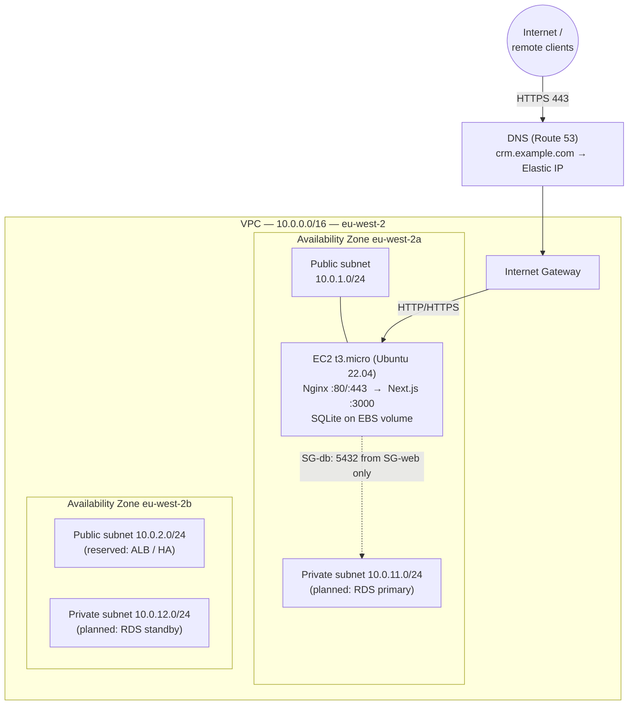

# Network Solution Design — Atlas Apparel Wholesale CRM

**Unit 6 criterion: C.P5 — Network solution design.**
This document specifies the AWS network the CRM is deployed into: the VPC, subnet
layout, IP addressing plan, routing, and security-group rules, plus an
architecture diagram.

> Region used throughout: **eu-west-2 (London)**. Change to your region if needed.

---

## 1. Architecture diagram

The **current** deployment is a single EC2 instance in a public subnet running
Nginx (TLS termination) in front of the Next.js server, with data in SQLite on
the instance's EBS volume. The private subnets and second AZ are part of the
design for the scaling path described in [improvements.md](improvements.md).

---

## 2. VPC

| Setting | Value |
|---|---|
| Name | `atlas-crm-vpc` |
| CIDR block | `10.0.0.0/16` (65,536 addresses) |
| Region | eu-west-2 (London) |
| Tenancy | Default |
| DNS hostnames / resolution | Enabled |

---

## 3. Subnet & IP addressing plan

Four subnets across two Availability Zones. AWS reserves the first 4 and last 1
address of every subnet (so a /24 yields 251 usable addresses).

| Subnet | CIDR | AZ | Type | Usable IPs | Purpose |
|---|---|---|---|---|---|
| `atlas-public-a` | `10.0.1.0/24` | eu-west-2a | Public | 251 | EC2 app/web server (current) |
| `atlas-public-b` | `10.0.2.0/24` | eu-west-2b | Public | 251 | Reserved for ALB / second app node |
| `atlas-private-a` | `10.0.11.0/24` | eu-west-2a | Private | 251 | Planned RDS primary |
| `atlas-private-b` | `10.0.12.0/24` | eu-west-2b | Private | 251 | Planned RDS standby (Multi-AZ) |

**Fixed/known addresses**

| Resource | Address | Notes |
|---|---|---|
| VPC router | `10.0.1.1` | AWS-reserved per subnet (.1) |
| EC2 private IP | `10.0.1.10` | Static private IP assigned to the instance |
| EC2 public IP | Elastic IP | Allocate an EIP so the public address is stable |

---

## 4. Routing

| Route table | Associated subnets | Destination | Target |
|---|---|---|---|
| `atlas-public-rt` | public-a, public-b | `10.0.0.0/16` | local |
| | | `0.0.0.0/0` | Internet Gateway (`atlas-igw`) |
| `atlas-private-rt` | private-a, private-b | `10.0.0.0/16` | local |
| | | `0.0.0.0/0` | NAT Gateway *(only if private hosts need outbound; has cost)* |

- **Internet Gateway** `atlas-igw` attached to the VPC gives the public subnet
  inbound/outbound internet access.
- A **NAT Gateway** is only required once workloads exist in the private subnets
  and need outbound internet (e.g. OS updates). It is optional for the current
  single-instance setup.

---

## 5. Security Groups (the firewall)

### `sg-web` — attached to the EC2 instance
Least-privilege: only web traffic from anywhere, SSH from your IP only.

| Direction | Type | Protocol | Port | Source / Dest | Reason |
|---|---|---|---|---|---|
| Inbound | HTTPS | TCP | 443 | `0.0.0.0/0` | Public app access (TLS) |
| Inbound | HTTP | TCP | 80 | `0.0.0.0/0` | Redirect to HTTPS + certbot challenge |
| Inbound | SSH | TCP | 22 | `<your-ip>/32` | Admin access only — **never** `0.0.0.0/0` |
| Outbound | All | All | All | `0.0.0.0/0` | Updates, certbot, package installs |

### `sg-db` — planned, attached to future RDS
| Direction | Type | Protocol | Port | Source | Reason |
|---|---|---|---|---|---|
| Inbound | PostgreSQL | TCP | 5432 | `sg-web` | DB reachable **only** from the app SG, not the internet |
| Outbound | All | All | All | `0.0.0.0/0` | — |

> Note: port **3000** (the Next.js process) is **not** exposed in any security
> group. It is reachable only on the instance's loopback; the internet reaches it
> exclusively through Nginx on 80/443.

---

## 6. How the app maps onto this design

- Remote client → `https://crm.example.com` (DNS → Elastic IP) → IGW → EC2.
- On the EC2 instance, **Nginx** terminates TLS on 443 and reverse-proxies to the
  **Next.js** server on `127.0.0.1:3000` (see [`deploy/nginx.conf`](../deploy/nginx.conf)).
- Next.js API routes read/write **SQLite** on the local EBS disk.
- See [`README.md`](../README.md) for the step-by-step build of this network.
